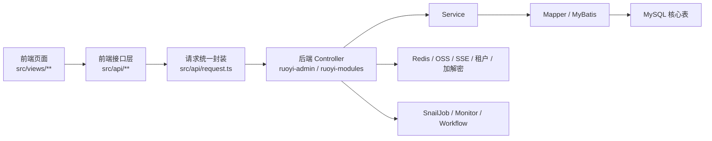

# 二次开发地图

> 本文是 `PROJECT_RULES.md` 的专题补充，目标是把 **后端模块、核心表、前端路由、常见二开入口** 固定成一份长期可复用的地图。  
> 以后新增功能、改页面、改表结构、改权限时，优先先看这份文档，再决定改哪些目录、接口与菜单。

## 1. 阅读顺序建议

建议后续接手本项目时，按下面顺序理解代码：

1. `PROJECT_RULES.md`
2. `SECONDARY_DEV_MAP.md`
3. 后端启动入口：`ruoyi-admin/src/main/java/org/dromara/DromaraApplication.java`
4. 登录与菜单入口：
   - `ruoyi-admin/src/main/java/org/dromara/web/controller/AuthController.java`
   - `ruoyi-modules/ruoyi-system/src/main/java/org/dromara/system/controller/system/SysMenuController.java`
5. 前端路由与请求入口：
   - `ruoyi-vben-ui/apps/web-antd/src/router/access.ts`
   - `ruoyi-vben-ui/apps/web-antd/src/router/routes/core.ts`
   - `ruoyi-vben-ui/apps/web-antd/src/router/routes/local.ts`
   - `ruoyi-vben-ui/apps/web-antd/src/api/request.ts`

---

## 2. 总体架构总图

### 2.1 标准请求链路

本项目绝大多数业务请求都遵循下面这条链路：

- 页面：`src/views/**/index.vue`
- API：`src/api/**/index.ts`
- 统一请求客户端：`src/api/request.ts`
- Controller：`ruoyi-admin` 或 `ruoyi-modules/*/controller`
- Service：对应业务服务层
- Mapper：对应 Mapper + XML / MyBatis-Plus
- 数据表：`sys_*` / `flow_*` / `sj_*` / `gen_*` / 业务表

### 2.2 二开时最重要的一个事实

这个项目的业务页面 **不是只靠前端本地路由文件生效**，而是以 **数据库 `sys_menu` + 后端 `/system/menu/getRouters` + 前端动态路由转换** 为主链路：

- 后端 `SysMenuController` 返回菜单树
- 前端 `getAllMenusApi()` 拉取菜单
- `backMenuToVbenMenu()` 把后端菜单转换为 Vben 可识别路由
- `menu.component` 最终映射到 `src/views/**` 下的 Vue 页面

结论：**新增业务页面时，通常必须同时改数据库菜单、后端接口、前端 API、前端页面。**

---

## 3. 后端二开地图

## 3.1 模块总览

| 模块 | 主要职责 | 二开时通常放什么 |
| --- | --- | --- |
| `ruoyi-admin` | 主启动入口、认证、首页、验证码、聚合所有业务模块 | 登录注册、首页输出、启动配置、全局接入 |
| `ruoyi-common/*` | 公共能力层 | 加解密、Redis、MyBatis、日志、权限、租户、OSS、SSE、WebSocket 等基础能力 |
| `ruoyi-modules/ruoyi-system` | 系统管理核心业务 | 用户、角色、菜单、部门、字典、参数、公告、租户、OSS、客户端、日志监控 |
| `ruoyi-modules/ruoyi-generator` | 代码生成器 | 基于表结构生成 CRUD 脚手架 |
| `ruoyi-modules/ruoyi-workflow` | 工作流业务 | 流程定义、实例、任务、表达式、请假示例 |
| `ruoyi-modules/ruoyi-job` | 任务执行器样例/任务实现 | 对账、汇总、广播、注解任务等执行器类 |
| `ruoyi-modules/ruoyi-demo` | 演示业务 | 单表树表 demo，适合参考增删改查模式 |
| `ruoyi-extend/ruoyi-monitor-admin` | Spring Boot Admin 扩展服务 | 监控后台服务本体 |
| `ruoyi-extend/ruoyi-snailjob-server` | SnailJob 扩展服务 | 调度中心服务本体 |

## 3.2 后端分层理解方式

### A. `ruoyi-admin`

这是整个后端的最终启动模块，主要看成三个角色：

- **主程序入口**：`DromaraApplication`
- **Web 聚合入口**：统一把 system / workflow / generator / demo / job 等模块装配进来
- **认证门户**：登录、登出、租户下拉、社交绑定、注册等接口都从这里进

适合放在这里的变更：

- 登录方式调整
- 注册流程调整
- 全局登录拦截/登录成功逻辑
- 统一启动配置

不建议放在这里的变更：

- 普通 CRUD 业务
- 业务专用 Service / Mapper

### B. `ruoyi-common/*`

这是公共底层，不是业务层。二开时尽量少动，除非你明确在扩展框架能力：

- `ruoyi-common-core`：基础对象、工具类、响应体
- `ruoyi-common-mybatis`：分页、MyBatis 扩展、数据源
- `ruoyi-common-redis`：缓存与 Redis 封装
- `ruoyi-common-satoken` / `ruoyi-common-security`：认证鉴权
- `ruoyi-common-encrypt`：接口加解密
- `ruoyi-common-tenant`：多租户能力
- `ruoyi-common-log`：操作日志
- `ruoyi-common-oss`：文件存储
- `ruoyi-common-sse`：站内消息 / SSE 推送
- `ruoyi-common-web`：Web 基础能力

二开建议：

- 只有当多个业务模块都要复用同一能力时，才考虑放到 `ruoyi-common`
- 仅仅是某个业务自己的工具方法，优先留在业务模块内部

### C. `ruoyi-modules/ruoyi-system`

这是后续二开的高频主战场，系统内管后台的大部分页面都落在这里。

#### 系统管理控制器地图

| 业务域 | Controller | 路径前缀 | 主要职责 | 核心表 |
| --- | --- | --- | --- | --- |
| 登录与菜单装载 | `AuthController` / `SysMenuController` | `/auth` / `/system/menu` | 登录、租户下拉、动态路由菜单 | `sys_user` `sys_menu` `sys_role_menu` |
| 用户管理 | `SysUserController` | `/system/user` | 用户 CRUD、授权、导入导出、密码重置 | `sys_user` `sys_user_role` `sys_user_post` |
| 角色管理 | `SysRoleController` | `/system/role` | 角色 CRUD、菜单授权、数据权限 | `sys_role` `sys_role_menu` `sys_role_dept` |
| 菜单管理 | `SysMenuController` | `/system/menu` | 菜单 CRUD、路由树、角色菜单树 | `sys_menu` |
| 部门管理 | `SysDeptController` | `/system/dept` | 组织架构树 | `sys_dept` |
| 岗位管理 | `SysPostController` | `/system/post` | 岗位配置 | `sys_post` `sys_user_post` |
| 字典管理 | `SysDictTypeController` / `SysDictDataController` | `/system/dict/type` / `/system/dict/data` | 枚举字典 | `sys_dict_type` `sys_dict_data` |
| 参数设置 | `SysConfigController` | `/system/config` | 系统参数 | `sys_config` |
| 通知公告 | `SysNoticeController` | `/system/notice` | 公告管理 | `sys_notice` |
| OSS | `SysOssController` / `SysOssConfigController` | `/system/oss` / `/system/oss/config` | 文件管理、存储配置 | `sys_oss` `sys_oss_config` |
| OAuth / 社交 | `SysSocialController` | `/system/social` | 社交绑定 | `sys_social` |
| 客户端管理 | `SysClientController` | `/system/client` | OAuth 客户端与授权类型 | `sys_client` |
| 租户管理 | `SysTenantController` | `/system/tenant` | 租户 CRUD、状态、域名等 | `sys_tenant` |
| 租户套餐 | `SysTenantPackageController` | `/system/tenant/package` | 套餐与可用菜单范围 | `sys_tenant_package` `sys_menu` |
| 在线用户 | `SysUserOnlineController` | `/monitor/online` | 在线会话、强退 | 运行态为主，关联登录态缓存 |
| 登录日志 | `SysLogininforController` | `/monitor/logininfor` | 登录日志分页与清理 | `sys_logininfor` |
| 操作日志 | `SysOperlogController` | `/monitor/operlog` | 操作日志查询 | `sys_oper_log` |
| 缓存监控 | `CacheController` | `/monitor/cache` | Redis 命令统计/内存/键空间 | Redis 为主 |

**后续迭代大概率先改这里：**

- 新增后台管理页面
- 新增权限码
- 新增菜单树
- 新增用户/角色/租户关联逻辑
- 接入新的字典、参数、文件上传

### D. `ruoyi-modules/ruoyi-generator`

这是“从表结构快速生成 CRUD”的模块。

核心入口：

- Controller：`GenController`
- 路径前缀：`/tool/gen`
- 核心表：`gen_table`、`gen_table_column`

典型用途：

- 把数据库物理表导入生成器
- 维护字段展示方式、查询方式、表单方式
- 生成前后端代码初稿

二开建议：

- 若你要新增标准台账型 CRUD，优先先经过生成器，再人工清理和收敛代码
- 生成器适合“起步”，不适合把复杂业务全交给它

### E. `ruoyi-modules/ruoyi-workflow`

这是第二个高频二开战场，适合审批流、流程定义、流程实例、我的待办/已办/抄送等需求。

#### 工作流控制器地图

| 业务域 | Controller | 路径前缀 | 主要职责 | 核心表 |
| --- | --- | --- | --- | --- |
| 流程分类 | `FlwCategoryController` | `/workflow/category` | 分类增删改查 | `flow_category` |
| 流程定义 | `FlwDefinitionController` | `/workflow/definition` | 定义设计、发布、导入导出、激活挂起 | `flow_definition` `flow_node` |
| 流程实例 | `FlwInstanceController` | `/workflow/instance` | 实例分页、变量、状态查看 | `flow_instance` `flow_instance_biz_ext` |
| 流程表达式 | `FlwSpelController` | `/workflow/spel` | 审批表达式、条件规则 | `flow_spel` |
| 流程任务 | `FlwTaskController` | `/workflow/task` | 启动流程、待办/已办/抄送、审批、退回、转办、催办 | `flow_task` `flow_his_task` |
| 示例业务 | `TestLeaveController` | `/workflow/leave` | 请假业务示例 | `test_leave` |

适合放在这里的需求：

- 审批流
- 流程节点设计
- 待办中心
- 业务单据 + 流程挂接

### F. `ruoyi-modules/ruoyi-job`

这个模块 **不是一个常规的 Controller + 页面 CRUD 模块**，而更像是调度任务执行器集合。

当前更像：

- 任务执行器实现层
- SnailJob 执行样例
- 广播任务 / 注解任务 / 对账任务样例

适合放在这里的需求：

- 定时任务执行逻辑
- 对账、清理、汇总、补偿等离线任务
- 接入 SnailJob 的业务执行器

不适合直接放在这里的内容：

- 普通后台页面
- 页面型管理功能

### G. `ruoyi-modules/ruoyi-demo`

这个模块主要用于演示：

- 单表示例：`test_demo`
- 树表示例：`test_tree`

价值不在于业务本身，而在于：

- 可以快速参考标准 CRUD 代码组织方式
- 新同学熟悉前后端联动时非常适合对照着看

### H. `ruoyi-extend`

扩展服务与主后台并列存在：

- `ruoyi-monitor-admin`：Spring Boot Admin 服务本体
- `ruoyi-snailjob-server`：SnailJob 调度中心本体

需要注意：

- 前端 `monitor/admin` 与 `monitor/snailjob` 页面本质上是 iframe 包装
- 这些页面是否可用，取决于扩展服务是否真正启动，而不只是主后台是否启动

---

## 4. 核心表地图

## 4.1 权限、组织、租户主链路

这一组是后台管理系统最核心的一层：

| 表名 | 作用 | 常见联动 |
| --- | --- | --- |
| `sys_tenant` | 租户主表 | 与登录租户下拉、租户状态、租户域名相关 |
| `sys_tenant_package` | 租户套餐 | 决定租户可使用的菜单/能力范围 |
| `sys_user` | 用户主表 | 关联部门、岗位、角色、登录 |
| `sys_dept` | 部门树 | 用户归属、数据范围、组织结构 |
| `sys_post` | 岗位表 | 用户岗位 |
| `sys_role` | 角色表 | 权限主体 |
| `sys_menu` | 菜单/路由/权限标识 | 前端动态路由核心来源 |
| `sys_user_role` | 用户-角色关联 | 授权 |
| `sys_role_menu` | 角色-菜单关联 | 菜单权限 |
| `sys_role_dept` | 角色-部门关联 | 数据权限 |
| `sys_user_post` | 用户-岗位关联 | 岗位授权 |
| `sys_social` | 社交绑定 | 第三方登录与绑定 |

### 4.1.1 这一组表的真实业务链路

可以把它理解成：

- `sys_user` 决定“谁”
- `sys_role` 决定“能做什么”
- `sys_menu` 决定“看到什么页面、具备什么权限码”
- `sys_dept` 决定“组织归属和数据边界”
- `sys_tenant` / `sys_tenant_package` 决定“租户级可用范围”

如果你改以下内容，优先看这组表：

- 新增页面权限
- 登录后菜单不显示
- 某角色看不到某菜单
- 某租户不可见某模块

## 4.2 系统配置与基础设施表

| 表名 | 作用 | 常见页面/模块 |
| --- | --- | --- |
| `sys_dict_type` | 字典类型 | 字典管理 |
| `sys_dict_data` | 字典数据 | 下拉选项、标签映射 |
| `sys_config` | 系统参数 | 参数设置、开关项 |
| `sys_notice` | 公告 | 通知公告 |
| `sys_logininfor` | 登录日志 | 登录日志监控 |
| `sys_oper_log` | 操作日志 | 操作日志监控 |
| `sys_oss` | 文件记录 | 文件管理 |
| `sys_oss_config` | 存储配置 | OSS 配置 |
| `sys_client` | OAuth 客户端 | 客户端管理 |

这一组通常支撑“系统运行能力”，不是纯业务主表，但改动频率很高。

## 4.3 代码生成器表

| 表名 | 作用 | 说明 |
| --- | --- | --- |
| `gen_table` | 生成器主配置 | 一张业务表对应一条生成配置 |
| `gen_table_column` | 生成器字段配置 | 控制列表、查询、表单、校验、字典等 |

当你要快速新建 CRUD 时，这两张表很重要。

## 4.4 工作流表

### 4.4.1 流程定义层

| 表名 | 作用 |
| --- | --- |
| `flow_category` | 流程分类 |
| `flow_definition` | 流程定义主表 |
| `flow_node` | 节点定义 |
| `flow_skip` | 跳过规则 |
| `flow_spel` | 表达式与条件规则 |

### 4.4.2 流程运行层

| 表名 | 作用 |
| --- | --- |
| `flow_instance` | 流程实例主表 |
| `flow_task` | 当前待办任务 |
| `flow_his_task` | 历史办理任务 |
| `flow_instance_biz_ext` | 流程实例与业务数据扩展关系 |
| `flow_user` | 流程相关用户信息 |

### 4.4.3 示例业务表

| 表名 | 作用 |
| --- | --- |
| `test_leave` | 请假业务示例表 |

### 4.4.4 工作流理解顺序

建议按下面顺序理解：

1. `flow_category`
2. `flow_definition`
3. `flow_node` / `flow_spel`
4. `flow_instance`
5. `flow_task` / `flow_his_task`
6. `flow_instance_biz_ext`
7. 具体业务表，如 `test_leave`

## 4.5 SnailJob 表

SnailJob 相关表较多，建议按“配置层”和“运行层”分开看。

### 4.5.1 配置层

| 表名 | 作用 |
| --- | --- |
| `sj_namespace` | 命名空间 |
| `sj_group_config` | 分组配置 |
| `sj_retry_scene_config` | 重试场景配置 |
| `sj_notify_config` | 通知配置 |
| `sj_notify_recipient` | 通知接收人 |
| `sj_job_executor` | 执行器注册 |
| `sj_system_user` | 系统用户 |
| `sj_system_user_permission` | 系统用户权限 |

### 4.5.2 运行层

| 表名 | 作用 |
| --- | --- |
| `sj_job` | 作业主记录 |
| `sj_job_task` | 作业任务 |
| `sj_job_task_batch` | 作业批次 |
| `sj_job_log_message` | 作业日志 |
| `sj_job_summary` | 作业汇总 |
| `sj_retry` | 重试主记录 |
| `sj_retry_task` | 重试任务 |
| `sj_retry_task_log_message` | 重试日志 |
| `sj_retry_dead_letter` | 死信记录 |
| `sj_retry_summary` | 重试汇总 |
| `sj_workflow` | 作业工作流 |
| `sj_workflow_node` | 工作流节点 |
| `sj_workflow_task_batch` | 工作流批次 |
| `sj_server_node` | 服务节点 |
| `sj_distributed_lock` | 分布式锁 |

二开时如果只是“写一个业务任务”，通常先改 `ruoyi-job` 执行器代码，不一定直接改这些表。

## 4.6 Demo 表

| 表名 | 作用 |
| --- | --- |
| `test_demo` | 单表示例 |
| `test_tree` | 树表示例 |

这两张表最适合作为“快速模仿模板”。

---

## 5. 前端页面与路由地图

## 5.1 固定静态路由

这些路由不依赖数据库菜单，直接在前端源码里声明：

| 路由 | 说明 | 来源文件 |
| --- | --- | --- |
| `/` | 根路由容器 | `src/router/routes/core.ts` |
| `/social-callback` | 社交登录回调 | `src/router/routes/core.ts` |
| `/auth/login` | 账号登录 | `src/router/routes/core.ts` |
| `/auth/code-login` | 验证码/免密类登录页 | `src/router/routes/core.ts` |
| `/auth/qrcode-login` | 二维码登录 | `src/router/routes/core.ts` |
| `/auth/forget-password` | 忘记密码 | `src/router/routes/core.ts` |
| `/auth/register` | 注册 | `src/router/routes/core.ts` |
| `/analytics` | 仪表盘首页 | `src/router/routes/local.ts` |
| `/workspace` | 工作台 | `src/router/routes/local.ts` |
| `/profile` | 个人中心 | `src/router/routes/local.ts` |
| `/vben-admin/about` | 关于页 | `src/router/routes/local.ts` |
| `/changelog` | 更新记录 | `src/router/routes/local.ts` |

## 5.2 动态菜单路由机制

这是前端二开必须理解的核心机制。

### 5.2.1 菜单来源

- 前端通过 `src/api/core/menu.ts` 调用 `GET /system/menu/getRouters`
- 后端 `SysMenuController#getRouters()` 返回当前用户可见菜单树

### 5.2.2 路由转换规则

`src/router/access.ts` 中的 `backMenuToVbenMenu()` 会做这些事情：

- `Layout` → `BasicLayout`
- `InnerLink` → `IFrameView`
- 外链菜单 → `Link`
- 三级以上父级菜单 `ParentView` → 空组件容器
- 普通业务组件 → `/${menu.component}`

### 5.2.3 页面定位规则

页面真实文件来源：

- `pageMap = import.meta.glob('../views/**/*.vue')`

这意味着：

- 菜单 `component = system/user/index`
- 实际会匹配到 `src/views/system/user/index.vue`

### 5.2.4 二开中的硬规则

如果你新增一个菜单型页面，至少要同时满足下面四件事：

1. `sys_menu` 中存在对应菜单记录
2. `sys_menu.component` 与前端 `src/views/**` 路径能对上
3. 前端存在对应 `src/api/**` 接口文件
4. 后端存在对应 Controller / Service / 数据层

少任何一环，页面通常都不会正常出现或无法工作。

## 5.3 当前数据库中的一级菜单快照

当前已确认的一级菜单主干包括：

- `system`：系统管理
- `tenant`：租户管理
- `monitor`：系统监控
- `tool`：系统工具
- `demo`：测试菜单
- `workflow`：工作流
- `task`：我的任务

## 5.4 当前业务页面地图

下表按“页面 → API → 后端 → 表”来组织，便于直接定位二开入口。

| 页面/路由 | Vue 组件路径 | 前端 API | 后端控制器 | 核心表 |
| --- | --- | --- | --- | --- |
| `/system/user` | `src/views/system/user/index.vue` | `src/api/system/user/index.ts` | `SysUserController` | `sys_user` `sys_user_role` `sys_user_post` |
| `/system/role` | `src/views/system/role/index.vue` | `src/api/system/role/index.ts` | `SysRoleController` | `sys_role` `sys_role_menu` `sys_role_dept` |
| `/system/menu` | `src/views/system/menu/index.vue` | `src/api/system/menu/index.ts` | `SysMenuController` | `sys_menu` |
| `/system/dept` | `src/views/system/dept/index.vue` | `src/api/system/dept/index.ts` | `SysDeptController` | `sys_dept` |
| `/system/post` | `src/views/system/post/index.vue` | `src/api/system/post/index.ts` | `SysPostController` | `sys_post` `sys_user_post` |
| `/system/dict` | `src/views/system/dict/index.vue` | `src/api/system/dict/*` | `SysDictTypeController` / `SysDictDataController` | `sys_dict_type` `sys_dict_data` |
| `/system/config` | `src/views/system/config/index.vue` | `src/api/system/config/index.ts` | `SysConfigController` | `sys_config` |
| `/system/notice` | `src/views/system/notice/index.vue` | `src/api/system/notice/index.ts` | `SysNoticeController` | `sys_notice` |
| `/system/oss` | `src/views/system/oss/index.vue` | `src/api/system/oss/index.ts` | `SysOssController` | `sys_oss` |
| `/system/client` | `src/views/system/client/index.vue` | `src/api/system/client/index.ts` | `SysClientController` | `sys_client` |
| `租户相关页面` | `src/views/system/tenant/*` / `src/views/system/tenantPackage/*` | `src/api/system/tenant/*` / `src/api/system/tenant-package/*` | `SysTenantController` / `SysTenantPackageController` | `sys_tenant` `sys_tenant_package` |
| `/monitor/online` | `src/views/monitor/online/index.vue` | `src/api/monitor/online/index.ts` | `SysUserOnlineController` | 运行态 / 在线会话 |
| `/monitor/logininfor` | `src/views/monitor/logininfor/index.vue` | `src/api/monitor/logininfo/index.ts` | `SysLogininforController` | `sys_logininfor` |
| `/monitor/operlog` | `src/views/monitor/operlog/index.vue` | `src/api/monitor/operlog/index.ts` | `SysOperlogController` | `sys_oper_log` |
| `/monitor/cache` | `src/views/monitor/cache/index.vue` | `src/api/monitor/cache/index.ts` | `CacheController` | Redis |
| `/monitor/admin` | `src/views/monitor/admin/index.vue` | iframe 页面 | 扩展服务 `ruoyi-monitor-admin` | 监控服务 |
| `/monitor/snailjob` | `src/views/monitor/snailjob/index.vue` | iframe 页面 | 扩展服务 `ruoyi-snailjob-server` | `sj_*` |
| `/tool/gen` | `src/views/tool/gen/index.vue` | `src/api/tool/gen/index.ts` | `GenController` | `gen_table` `gen_table_column` |
| `/demo/demo` | `src/views/demo/demo/index.vue` | demo API/模块 | Demo Controller | `test_demo` |
| `/demo/tree` | `src/views/demo/tree/index.vue` | demo API/模块 | Demo Controller | `test_tree` |
| `/workflow/category` | `src/views/workflow/category/index.vue` | `src/api/workflow/category/index.ts` | `FlwCategoryController` | `flow_category` |
| `/workflow/spel` | `src/views/workflow/spel/index.vue` | workflow spel API | `FlwSpelController` | `flow_spel` |
| `/workflow/processDefinition` | `src/views/workflow/processDefinition/index.vue` | `src/api/workflow/definition/index.ts` | `FlwDefinitionController` | `flow_definition` `flow_node` |
| `/workflow/processInstance` | `src/views/workflow/processInstance/index.vue` | `src/api/workflow/instance/index.ts` | `FlwInstanceController` | `flow_instance` |
| `/workflow/leave` | `src/views/workflow/leave/index.vue` | workflow leave / task API | `TestLeaveController` / `FlwTaskController` | `test_leave` `flow_instance` |
| `/workflow/task/myDocument` | `src/views/workflow/task/myDocument.vue` | `src/api/workflow/task/index.ts` | `FlwTaskController` | `flow_instance` `flow_task` |
| `/workflow/task/taskWaiting` | `src/views/workflow/task/taskWaiting.vue` | `src/api/workflow/task/index.ts` | `FlwTaskController` | `flow_task` |
| `/workflow/task/taskFinish` | `src/views/workflow/task/taskFinish.vue` | `src/api/workflow/task/index.ts` | `FlwTaskController` | `flow_his_task` |
| `/workflow/task/taskCopyList` | `src/views/workflow/task/taskCopyList.vue` | `src/api/workflow/task/index.ts` | `FlwTaskController` | `flow_task` |

## 5.5 当前已知隐藏/详情路由

这些页面通常不会直接在侧边菜单显示，但经常是二开时要补的详情页：

| 路由 | 用途 | 对应页面 |
| --- | --- | --- |
| `/system/user/authRole` | 用户分配角色 | `src/views/system/user/authRole.vue` |
| `/system/role-auth/user/:roleId` | 角色分配用户 | `src/views/system/role/authUser.vue` |
| `/system/dict/data` | 字典数据详情页 | `src/views/system/dict/data.vue` 或 `src/views/system/dict/data/index.vue` |
| `/tool/gen-edit/index/:tableId` | 生成器编辑页 | `src/views/tool/gen/editTable.vue` |
| `/workflow/design/index` | 流程设计页 | `src/views/workflow/processDefinition/design.vue` |
| `/workflow/leaveEdit/index` | 请假编辑页 | `src/views/workflow/leave/leaveEdit.vue` |

需要特别注意：

- 这些隐藏路由很多不是直接由 `sys_menu.component` 原样输出
- 有一部分经过 `src/router/access.ts` 里的 `routeMetaMapping` 做了 `activePath` 等特殊处理

---

## 6. 常见二开入口

## 6.1 新增一个标准后台管理页面

推荐顺序：

1. 明确该需求属于哪个模块：`ruoyi-system` / `ruoyi-workflow` / 新业务模块
2. 先确定数据库表与字段
3. 后端补齐：
   - domain / bo / vo
   - mapper / service / controller
4. 前端补齐：
   - `src/api/业务域/index.ts`
   - `src/views/业务域/index.vue`
5. 在 `sys_menu` 新增菜单与权限标识
6. 给角色分配 `sys_role_menu`
7. 联调后再决定是否进入代码生成器维护

### 判断标准

- 纯系统内管台账：优先放 `ruoyi-system`
- 流程审批类：优先放 `ruoyi-workflow`
- 离线任务/对账：优先放 `ruoyi-job`
- 扩展服务本体：放 `ruoyi-extend`

## 6.2 新增一个菜单权限

最小影响面通常是：

- 后端：补 Controller 权限码
- 数据库：补 `sys_menu`
- 角色关联：补 `sys_role_menu`
- 前端：若是新页面则补 `src/views/**`

最常见误区：

- 只写了 Vue 页面，没有写 `sys_menu`
- 只写了 `sys_menu`，但 `component` 路径对不上 Vue 文件
- 只给了菜单，没有给按钮权限码

## 6.3 新增一个隐藏详情页

如果页面需要“列表页跳详情页，但菜单不单独显示”，常见做法是：

- 页面文件单独建在 `src/views/**`
- 菜单配置为隐藏，或使用现有隐藏路由模式
- 如需保持左侧菜单高亮，参考 `routeMetaMapping` 处理 `activePath`

## 6.4 新增一个工作流业务

推荐顺序：

1. 先建业务主表
2. 明确是否需要流程实例扩展表关联
3. 在 `flow_category` / `flow_definition` 中建立流程定义
4. 参考 `TestLeaveController` + `workflow/leave/*` 完成页面和接口
5. 任务中心统一复用 `FlwTaskController`

适合这样做的业务：

- 请假
- 报销
- 用章
- 采购申请
- 合同审批

## 6.5 新增一个离线任务 / 补偿任务

建议优先判断：

- 是普通后台页面配置型需求，还是后台真正执行型任务

如果是执行型任务：

- 任务实现写在 `ruoyi-job`
- 调度中心展示与运维查看走 SnailJob 体系
- 前端 `monitor/snailjob` 只是入口，不是任务逻辑本体

## 6.6 先用生成器，再手工收敛

适合用生成器起步的情况：

- 标准增删改查
- 表结构清晰
- 后端查询条件与表单项较规则

不适合只靠生成器的情况：

- 跨多表聚合
- 强权限判断
- 流程驱动业务
- 复杂审批/状态机

---

## 7. 当前项目高频改动点建议

优先级最高的二开热点如下：

1. **`ruoyi-modules/ruoyi-system`**
   - 大部分系统内管页面都从这里下手
2. **`ruoyi-vben-ui/apps/web-antd/src/views`**
   - 页面都在这里收口
3. **`ruoyi-vben-ui/apps/web-antd/src/api`**
   - 所有联调都要看这里
4. **`sys_menu`**
   - 动态菜单路由的真正入口
5. **`flow_*`**
   - 只要牵涉审批流，就要一起看

---

## 8. 二开时的几个高风险误区

- **误区 1：把它当成纯前端路由项目**
  - 实际上大部分业务路由是数据库菜单驱动的
- **误区 2：只改页面，不改权限**
  - 页面能写出来，但角色可能永远看不到
- **误区 3：只改 Controller，不改 `src/api`**
  - 前端并不会自动知道接口怎么调
- **误区 4：把任务调度当成普通 CRUD**
  - `ruoyi-job` 更偏执行器与作业逻辑，不是页面模块
- **误区 5：忽略接口加解密**
  - 某些接口（特别是登录/密码相关）前端会带 `encrypt: true`
- **误区 6：忽略租户和角色**
  - 你看到的菜单、数据范围、登录租户都可能受租户/角色影响

---

## 9. 推荐的二开落点速查

| 需求类型 | 优先改哪里 |
| --- | --- |
| 新增后台 CRUD 页面 | `ruoyi-modules/ruoyi-system` + `src/api/system` + `src/views/system` + `sys_menu` |
| 新增租户能力 | `SysTenantController` / `SysTenantPackageController` + `sys_tenant*` |
| 新增审批业务 | `ruoyi-modules/ruoyi-workflow` + `src/views/workflow` + `flow_*` |
| 新增代码生成模板类功能 | `ruoyi-modules/ruoyi-generator` + `gen_*` |
| 新增离线任务 | `ruoyi-modules/ruoyi-job` + SnailJob |
| 新增监控页入口 | `src/views/monitor/*`，如需真实能力同时启动 `ruoyi-extend` |
| 新增认证方式 | `ruoyi-admin` 的登录认证链路 + `sys_client` / `sys_social` |

---

## 10. 本文结论

如果只记住一句话，可以记住这个：

> **本项目的二开主链路 = 前端页面 `src/views` + 前端接口 `src/api` + 后端业务模块 `ruoyi-modules/*` + 权限菜单表 `sys_menu` + 对应业务主表。**

以后迭代前，先问自己下面四个问题：

1. 这次需求属于哪个模块？
2. 这次需求涉及哪组核心表？
3. 这次需求是否需要新增 `sys_menu` / 权限码？
4. 这次需求是普通 CRUD、流程业务，还是离线任务？

只要这四个问题先答清楚，后面的二开效率会高很多。
