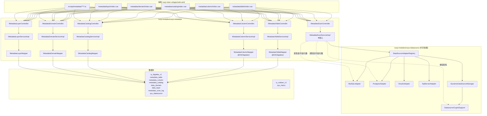

# 数据中台元数据平台 — 第一期开发计划（CEO Review 通过）

## CEO Review 摘要

- **Mode**: SELECTIVE EXPANSION（最小闭环为基准，cherry-pick 3 个高性价比扩展）
- **Cherry-picks**: 3/3 全部采纳（别名编辑、全文搜索、UPDATE_TIME）
- **Spec Review**: Round 1 (5/10) → Round 2 (8.2/10)
- **评审结论**: 计划准备就绪（UNRESOLVED = 0）

---

## 背景与目标

参照 `bgdata/bagdatahouse-server` 元数据体系，本次**仅开发元数据内容**，不涉及数据质量、数据安全、数据探查等子模块。目标是**最小闭环**：通过已注册的数据源（`sys_datasource`）自动扫描表/字段元数据入库，支持数据域 + 数仓分层 + 资产目录管理。

**愿景**：让找数据像搜索一样简单。当用户输入"用户订单"，系统立刻展示所有相关表（跨数据源）、字段血缘、敏感等级、数据负责人。

---

## 一、架构设计




**架构决策**：`MetadataScanServiceImpl` **直接依赖** `DataSourceAdapterRegistry`（不抽象接口层）。同仓库兄弟模块，无跨仓库兼容问题，保持简单。

---

## 二、后端模块：`ruoyi-modules/ruoyi-metadata`

### 2.1 模块结构

```
ruoyi-modules/ruoyi-metadata/
├── pom.xml
└── src/main/java/org/dromara/metadata/
    ├── controller/
    │   ├── MetadataTableController.java      # /system/metadata/table
    │   ├── MetadataColumnController.java      # /system/metadata/column
    │   ├── MetadataScanController.java         # /system/metadata/scan
    │   ├── MetadataCatalogController.java      # /system/metadata/catalog
    │   ├── MetadataDomainController.java       # /system/metadata/domain
    │   └── MetadataLayerController.java       # /system/metadata/layer
    ├── service/
    │   ├── IMetadataTableService.java + impl/MetadataTableServiceImpl.java
    │   ├── IMetadataColumnService.java + impl/MetadataColumnServiceImpl.java
    │   ├── IMetadataScanService.java + impl/MetadataScanServiceImpl.java
    │   ├── IMetadataCatalogService.java + impl/MetadataCatalogServiceImpl.java
    │   ├── IMetadataDomainService.java + impl/MetadataDomainServiceImpl.java
    │   └── IMetadataLayerService.java
    ├── mapper/
    │   ├── MetadataTableMapper.java           # @DS("bigdata")
    │   ├── MetadataColumnMapper.java           # @DS("bigdata")
    │   ├── MetadataCatalogMapper.java
    │   ├── MetadataDomainMapper.java
    │   └── MetadataLayerMapper.java
    ├── domain/
    │   ├── MetadataTable.java                 # Entity，继承 TenantEntity
    │   ├── MetadataColumn.java                # Entity，继承 TenantEntity
    │   ├── MetadataCatalog.java               # Entity，继承 TenantEntity
    │   ├── MetadataDomain.java                # Entity，继承 TenantEntity
    │   ├── MetadataLayer.java                 # Entity（无租户字段）
    │   ├── MetadataScanLog.java               # Entity（扫描记录）
    │   ├── bo/...Bo.java
    │   └── vo/...Vo.java
    └── enums/
        ├── MetadataStatusEnum.java
        ├── SensitivityLevelEnum.java
        └── CatalogTypeEnum.java
```

### 2.2 核心 Entity 设计

#### `metadata_table` — 元数据表


| 字段                                    | 类型            | 说明                                            |
| ------------------------------------- | ------------- | --------------------------------------------- |
| `id`                                  | BIGINT        | PK                                            |
| `ds_id`                               | BIGINT        | 关联数据源 ID                                      |
| `ds_name` / `ds_code`                 | VARCHAR       | 数据源名称/编码（冗余）                                  |
| `table_name`                          | VARCHAR(200)  | 物理表名                                          |
| `table_alias`                         | VARCHAR(200)  | **表中文别名（可编辑）**                                |
| `table_comment`                       | VARCHAR(1000) | 表注释                                           |
| `table_type`                          | VARCHAR(30)   | TABLE / VIEW                                  |
| `data_layer`                          | VARCHAR(20)   | ODS / DWD / DWS / ADS                         |
| `data_domain`                         | VARCHAR(50)   | 数据域                                           |
| `row_count`                           | BIGINT        | 行数                                            |
| `storage_bytes`                       | BIGINT        | 存储大小估算                                        |
| `update_time`                         | DATETIME      | **源表最后更新时间（cherry-pick #3）**                  |
| `sensitivity_level`                   | VARCHAR(20)   | NORMAL / INNER / SENSITIVE / HIGHLY_SENSITIVE |
| `owner_id` / `dept_id` / `catalog_id` | BIGINT        | 归属                                            |
| `tags`                                | VARCHAR(500)  | 标签                                            |
| `last_scan_time`                      | DATETIME      | 最后扫描时间                                        |
| `status`                              | VARCHAR(20)   | ACTIVE / ARCHIVED / DEPRECATED                |
| `del_flag`                            | CHAR(1)       | 删除标记                                          |
| 标准审计字段                                |               | TenantEntity 基类字段                             |


**唯一索引**: `uk_ds_table` (`ds_id`, `table_name`)

#### `metadata_column` — 元数据字段


| 字段                                                   | 类型           | 说明                             |
| ---------------------------------------------------- | ------------ | ------------------------------ |
| `id`                                                 | BIGINT       | PK                             |
| `table_id`                                           | BIGINT       | 关联 metadata_table.id           |
| `ds_id` / `table_name`                               | —            | 冗余存储                           |
| `column_name`                                        | VARCHAR(100) | 字段名                            |
| `column_alias`                                       | VARCHAR(200) | **字段中文别名（可编辑，cherry-pick #1）** |
| `column_comment`                                     | VARCHAR(500) | 字段注释                           |
| `data_type`                                          | VARCHAR(50)  | 数据类型                           |
| `is_nullable` / `column_key` / `default_value`       | —            | DDL 信息                         |
| `is_primary_key` / `is_foreign_key` / `fk_reference` | —            | 键信息                            |
| `is_sensitive` / `sensitivity_level`                 | —            | 敏感等级                           |
| `sort_order`                                         | INT          | 字段排序                           |
| 标准审计字段                                               |              |                                |


**唯一索引**: `uk_ds_table_column` (`ds_id`, `table_name`, `column_name`)

#### `metadata_catalog` — 资产目录（树形，支持 BUSINESS_DOMAIN / DATA_DOMAIN / ALBUM）

#### `data_domain` — 数据域（复用 bagdatahouse 设计）

#### `data_layer` — 数仓分层（含内置 ODS/DWD/DWS/ADS 种子数据）

#### `metadata_scan_log` — 扫描记录（RUNNING/SUCCESS/FAILED/PARTIAL）

### 2.3 核心扫描服务

```java
// MetadataScanServiceImpl — 核心扫描主流程
public MetadataScanResultVo scanByDatasource(Long dsId, List<String> tableNames, boolean syncColumn) {
    // 1. 验证 dsId 存在
    SysDatasource ds = datasourceMapper.selectById(dsId);
    if (ds == null) throw new IllegalArgumentException("数据源不存在: " + dsId);

    // 2. 解密密码
    String password = datasourceCryptoSupport.decrypt(ds.getPassword());

    // 3. 获取或创建 adapter（带缓存）
    DataSourceAdapter adapter = adapterRegistry.getOrCreateAdapter(dsId, ds, password);

    // 4. 记录扫描开始
    MetadataScanLog scanLog = createScanLog(dsId, scanType, tableNames);

    // 5. 获取表列表
    List<String> tables = adapter.getTables();
    if (CollectionUtils.isNotEmpty(tableNames)) {
        tables = tables.stream().filter(tableNames::contains).toList();
    }

    // 6. 逐表扫描
    for (String table : tables) {
        try {
            String comment = adapter.getTableComment(table).orElse("");
            Long rowCount = adapter.getRowCount(table).orElse(null);
            String updateTime = adapter.getTableLastUpdateTime(table).orElse(null); // cherry-pick #3

            MetadataTable mt = buildMetadataTable(ds, table, comment, rowCount, updateTime);
            metadataTableService.upsert(mt);  // ON DUPLICATE KEY UPDATE

            if (syncColumn) {
                List<ColumnInfo> columns = adapter.getColumns(table);
                metadataColumnService.upsertBatch(tableId, dsId, table, columns);
            }

            scanLog.incrementSuccess();
        } catch (SQLException e) {
            log.warn("扫描表 {} 部分字段失败: {}", table, e.getMessage());
            scanLog.incrementPartial();
        } catch (Exception e) {
            log.error("扫描表 {} 失败: {}", table, e.getMessage());
            scanLog.addError(table, e.getMessage());
        }
    }

    // 7. 更新扫描记录
    scanLog.complete(successCount, partialCount, errorList);
    return buildResult(scanLog);
}
```

**错误处理策略**：


| 失败场景      | 处理方式                             | 用户看到             |
| --------- | -------------------------------- | ---------------- |
| dsId 不存在  | IllegalArgumentException → 400   | "数据源不存在"         |
| 密码解密失败    | 记录错误 → FAILED                    | "连接失败：密码解密错误"    |
| 连接超时（30s） | 重试 3 次（2s/4s/8s）→ 仍失败则 FAILED    | "连接超时，请检查网络"     |
| 权限不足      | 记录 warn → FAILED                 | "无权限，请联系 DBA 授权" |
| 单表字段部分失败  | 跳过该字段 → PARTIAL                  | "扫描完成但部分字段读取失败"  |
| 扫描被中断     | InterruptedException → CANCELLED | "扫描已取消"          |


**搜索防注入**：`keyword` 参数需转义 `%` 和 `_`：

```java
String safeKeyword = keyword
    .replace("\\", "\\\\")
    .replace("%", "\\%")
    .replace("_", "\\_");
```

**pageSize 上限**：`pageSize = Math.min(pageSize, 100)`。

**慢查询监控**：搜索耗时超过 5s 打印 WARN 日志。

**Adapter 兼容性**：新增 `getTableLastUpdateTime()` 方法，所有 Adapter 均需实现，不支持时返回 `Optional.empty()`。

---

## 三、数据库 Migration

### 3.1 完整 DDL（bigdata 库执行）

见 CEO Plan 源文件 `~/.gstack/projects/aaa/ceo-plans/2026-03-30-metadata-platform-phase1.md` 中的 Appendix A。

### 3.2 菜单落库（master 库执行）

menu_id 使用动态分配（需先查询 `MAX(menu_id)` 确保不冲突）。

---

## 四、前端：`ruoyi-vben-ui/apps/web-antd`

### 4.1 新建目录结构

```
src/api/metadata/
├── table/index.ts      # 元数据表 API（含搜索参数）
├── column/index.ts     # 字段 API（含 keyword 搜索）
├── catalog/index.ts    # 资产目录 API
├── domain/index.ts     # 数据域 API
├── layer/index.ts      # 数仓分层 API
└── scan/index.ts       # 扫描触发 API

src/views/metadata/
├── table/index.vue     # 元数据表列表 + 工具栏（全量扫描按钮 dropdown）
├── column/index.vue    # 字段详情（Drawer）
├── catalog/index.vue   # 资产目录树
├── domain/index.vue    # 数据域管理
└── layer/index.vue     # 数仓分层管理
```

### 4.2 菜单设计


| Menu ID | 名称           | 类型  | component                | 权限码                                    |
| ------- | ------------ | --- | ------------------------ | -------------------------------------- |
| 2100    | 元数据平台        | C   | `metadata/table/index`   | —                                      |
| 2101    | 元数据表         | C   | `metadata/table/index`   | `metadata:table:list`                  |
| 2102    | 资产目录         | C   | `metadata/catalog/index` | `metadata:catalog:list`                |
| 2103    | 数据域          | C   | `metadata/domain/index`  | `metadata:domain:list`                 |
| 2104    | 数仓分层         | C   | `metadata/layer/index`   | `metadata:layer:list`                  |
| 按钮      | 表查询/新增/修改/删除 | F   | —                        | `metadata:table:query/add/edit/remove` |
| 按钮      | 扫描入库         | F   | —                        | `metadata:scan:exec`                   |
| 按钮      | 表导出          | F   | —                        | `metadata:table:export`                |
| 按钮      | 目录新增/修改/删除   | F   | —                        | `metadata:catalog:*`                   |
| 按钮      | 域新增/修改/删除    | F   | —                        | `metadata:domain:*`                    |


---

## 五、实施步骤

### Step 1：后端骨架 + 单元测试

- 新建 `pom.xml`，依赖 `ruoyi-datasource` + `ruoyi-common-mybatis`
- **⚠️ 实施前检查清单**：
  - 检查 `ruoyi-admin/pom.xml` dependencyManagement 是否已声明 `ruoyi-metadata`
  - 检查 `ruoyi-admin` 启动类 `@SpringBootApplication(scanBasePackages)` 是否包含 `org.dromara`
  - 在 `ruoyi-metadata/pom.xml` 显式声明传递依赖：`ruoyi-datasource`、`ruoyi-common-mybatis`
- 创建 6 个 Entity（继承 TenantEntity）+ Bo / Vo
- 创建 Mapper（`@DS("bigdata")`）+ Controller（占桩 + 权限注解）
- **编写 3 个 Maven 单元测试**：Happy Path、部分失败 Path、边界值 Path
- 路由前缀：`/system/metadata`

### Step 2：核心扫描服务

- 实现 `MetadataScanServiceImpl`（含 5 种错误处理）
- **⚠️ 租户隔离验证**：
  - 验证 `TenantHelper.getTenantId()` 在扫描后台线程中的返回值
  - 如果返回 null：Controller 层传入 `tenantId` → 保存到 ThreadLocal → 扫描入库时注入
  - 确保入库记录携带正确 `tenant_id`，防止跨租户数据泄露
- 实现 `MetadataTableService.upsert()`（ON DUPLICATE KEY UPDATE）
- 实现 `MetadataColumnService.upsertBatch()`
- **新增 `DataSourceAdapter.getTableLastUpdateTime()`** 各 Adapter 实现（含 schema 参数语义约定：MySQL 用 catalog 过滤，PostgreSQL 用 public schema）

### Step 3：完整 CRUD（含搜索 + 别名）

- MetadataTable：列表（keyword LIKE 搜索 + 分页上限 100）+ 别名编辑抽屉
- MetadataColumn：列表（keyword 搜索）+ 别名编辑
- MetadataCatalog：树形 CRUD
- MetadataDomain / MetadataLayer：CRUD + 内置数据

### Step 4：数据库 Migration

- bigdata 库：执行 6 张表 DDL + metadata_scan_log + data_layer 种子数据
- master 库：执行 sys_menu INSERT（**两阶段方案**：先查 MAX(menu_id) 确定偏移 → 插入父菜单 → 以父菜单 ID 插入子菜单 + 按钮权限）

### Step 5：前端页面

- 5 个页面 + 5 个 API 文件
- 工具栏增加"扫描数据源"按钮（dropdown，选数据源或全部）
- ODS/DWD/DWS/ADS 颜色标签展示

### Step 6：联调验证

- 后端编译 + Maven test
- 前端 npm run build
- 扫描链路：选一个 MySQL 数据源 → 触发扫描 → 查看入库结果
- 角色授权：给 admin 分配元数据菜单权限

---

## 六、安全审查


| 威胁     | 缓解                                                                        |
| ------ | ------------------------------------------------------------------------- |
| SQL 注入 | ✅ MyBatis PreparedStatement + 特殊字符转义                                      |
| 日志泄露密码 | ✅ 只记录 `e.getMessage()`，不记录 stack trace                                    |
| 水平越权   | ✅ **已验证**：Step 2 前检查 TenantHelper 在扫描线程中的返回值，Controller 层传入 tenantId 防止泄漏 |
| 扫描日志脱敏 | ✅ 错误日志只记录 message，不含敏感信息                                                  |


---

## 七、工程验证清单（Eng Review 新增）

### Step 1 前检查（E2）

- `ruoyi-admin/pom.xml` dependencyManagement 包含 `ruoyi-metadata`
- `ruoyi-admin` 启动类 `scanBasePackages` 包含 `org.dromara`
- `ruoyi-metadata/pom.xml` 显式依赖 `ruoyi-datasource`、`ruoyi-common-mybatis`

### Step 2 前检查（E4）

- `TenantHelper.getTenantId()` 在扫描后台线程中返回正确值
- Controller 传入 tenantId → Service 层注入 → metadata_table / metadata_column 记录携带正确 tenant_id

### Step 4 前检查（E1）

- sys_menu INSERT 使用两阶段方案（先父菜单获取 ID → 再插子菜单 + 按钮权限）
- 执行前查询 `SELECT MAX(menu_id) FROM sys_menu` 确定实际 ID 偏移

---

## 八、测试策略

必须覆盖：

1. **Happy Path**: Mock DataSourceAdapter，正常扫描入库
2. **Partial Failure**: 部分字段失败 → PARTIAL 状态
3. **Boundary**: 大表（10000 字段）批量处理
4. **Search Edge**: `keyword = "admin%_"` 搜索
5. **Pagination**: `pageSize = 99999` → 截断到 100

---

## 九、后续扩展（二期）


| 能力             | 依赖                      |
| -------------- | ----------------------- |
| 数据血缘（表级+字段级）   | metadata_table.id 已设计   |
| 业务术语（glossary） | metadata_table 已设计      |
| 扫描调度（SnailJob） | 扫描链路稳定后接入               |
| 敏感字段识别         | sec_sensitivity_rule 复用 |
| 全文索引优化         | LIKE '%' 慢查询出现后升级       |


---

## 十、关键未决议项（已确认处理方式）


| 问题          | 决定                                  |
| ----------- | ----------------------------------- |
| 并发扫描无锁      | Skip — 一期管理员手动触发，并发极少               |
| LIKE 特殊字符转义 | Skip — MyBatis Wrappers.like() 已防注入 |
| 扫描进度轮询      | 一期：2s 短轮询 + 5分钟超时 / 二期：SSE          |
| 全量扫描入口      | 一期：工具栏 dropdown 按钮                  |
| 扫描中断机制      | Deferred to 二期（SnailJob）            |


---

## GSTACK REVIEW REPORT


| Review        | Trigger               | Why                             | Runs | Status | Findings                                            |
| ------------- | --------------------- | ------------------------------- | ---- | ------ | --------------------------------------------------- |
| CEO Review    | `/plan-ceo-review`    | Scope & strategy                | 1    | CLEAR  | 3/3 cherry-picks accepted, 17 issues → 0 unresolved |
| Eng Review    | `/plan-eng-review`    | Architecture & tests (required) | 0    | —      | —                                                   |
| Design Review | `/plan-design-review` | UI/UX gaps                      | 0    | —      | —                                                   |


- **VERDICT:** CEO + ENG CLEARED — ready to implement
- **Lake Score:** 3/3 decisions chose complete option (A=9/10)
- **UNRESOLVED:** 0
- **Eng Review:** 4 issues found: E1 sys_menu SQL, E2 pom deps, E3 schema semantics, E4 tenant isolation — all resolved

---

## 十一、二期规划（做完一期后参考）

### 五大模块优先级与依赖关系

```
实施顺序: 2.1 扫描调度 → 2.2 业务术语 → 2.3 数据质量DQC → 2.4 数据血缘 → 2.5 智能搜索升级
```

> **注（2026-03-30 更新）**：数据质量 DQC 已提前至 2.3，原因是深入分析了 `bagdatahouse-server` 的 DQC 模块，确认其 21 个内置规则模板 + 7 张表 + 执行引擎设计可直接迁移复用到 RuoYi。DQC 依赖一期建好的 `metadata_table`、`metadata_column`、`data_layer`、`data_domain`，与扫描调度和业务术语无先后依赖，可以并行规划。


| #   | 模块       | 一期依赖                     | 复杂度 | 优先级    | 核心价值      |
| --- | -------- | ------------------------ | --- | ------ | --------- |
| 2.1 | 扫描调度     | ✅ 已有扫描链路                 | S   | **必须** | 元数据不过期    |
| 2.2 | 业务术语     | ✅ data_domain            | S   | **必须** | 非技术人员也能用  |
| 2.3 | 数据质量 DQC | ⚠️ metadata_table/column | L   | **必须** | 数据可信度评级   |
| 2.4 | 数据血缘     | ⚠️ metadata_table.id     | M   | 高价值    | 溯源 + 影响分析 |
| 2.5 | 智能搜索升级   | ⚠️ LIKE 已有一期             | M   | 高价值    | 搜索体验跃升    |


---

### 2.1 扫描调度（必须做）

**目标**: 让元数据永远不过期。定时全量扫描 + 事件触发 + 变更告警。

**新增表**:

```sql
-- metadata_scan_schedule — 扫描调度配置
CREATE TABLE `metadata_scan_schedule` (
    `id`             BIGINT(20) NOT NULL AUTO_INCREMENT,
    `ds_id`          BIGINT(20) NOT NULL COMMENT '数据源ID',
    `schedule_type`  VARCHAR(20) NOT NULL COMMENT 'MANUAL/CRON/EVENT',
    `cron_expr`      VARCHAR(50) DEFAULT NULL COMMENT 'Cron表达式',
    `enabled`         CHAR(1) DEFAULT '1' COMMENT '1=启用',
    `last_scan_time` DATETIME DEFAULT NULL COMMENT '上次扫描时间',
    `next_scan_time` DATETIME DEFAULT NULL COMMENT '下次扫描时间',
    `change_alert`   CHAR(1) DEFAULT '1' COMMENT '变更是否告警',
    `alert_targets` VARCHAR(500) DEFAULT NULL COMMENT '告警接收人',
    `del_flag`      CHAR(1) NOT NULL DEFAULT '0',
    PRIMARY KEY (`id`), KEY `idx_ds_id` (`ds_id`)
) ENGINE=InnoDB DEFAULT CHARSET=utf8mb4 COMMENT='扫描调度配置';

-- metadata_table_history — 表变更历史
CREATE TABLE `metadata_table_history` (
    `id`             BIGINT(20) NOT NULL AUTO_INCREMENT,
    `table_id`       BIGINT(20) NOT NULL COMMENT 'metadata_table.id',
    `snapshot_time`  DATETIME NOT NULL COMMENT '快照时间',
    `row_count`      BIGINT(20) DEFAULT NULL COMMENT '当时行数',
    `column_count`   INT DEFAULT NULL COMMENT '当时字段数',
    `column_hash`    VARCHAR(64) DEFAULT NULL COMMENT '字段名MD5（检测变更）',
    PRIMARY KEY (`id`), KEY `idx_table_id` (`table_id`)
) ENGINE=InnoDB DEFAULT CHARSET=utf8mb4 COMMENT='表变更历史';
```

**变更检测**: 扫描时比对 `column_hash`，变化则记录 history + 发送告警。

---

### 2.2 业务术语（必须做）

**目标**: 让非技术人员也能找表。"用户基本信息"→ 找到 dim_user_base_info。

```sql
-- gov_glossary_term — 业务术语
CREATE TABLE `gov_glossary_term` (
    `id`          BIGINT(20) NOT NULL AUTO_INCREMENT,
    `term_name`   VARCHAR(200) NOT NULL COMMENT '术语名称（如：订单）',
    `term_alias`  VARCHAR(500) DEFAULT NULL COMMENT '别名（逗号分隔）',
    `term_desc`   VARCHAR(1000) DEFAULT NULL COMMENT '术语定义',
    `category_id` BIGINT(20) DEFAULT NULL COMMENT '分类ID',
    `biz_owner`   BIGINT(20) DEFAULT NULL COMMENT '业务负责人',
    `status`      VARCHAR(20) DEFAULT 'DRAFT' COMMENT 'DRAFT/PUBLISHED/DEPRECATED',
    `del_flag`    CHAR(1) NOT NULL DEFAULT '0',
    PRIMARY KEY (`id`), UNIQUE KEY `uk_term_name` (`term_name`)
) ENGINE=InnoDB DEFAULT CHARSET=utf8mb4 COMMENT='业务术语';

-- gov_glossary_mapping — 术语↔资产关联
CREATE TABLE `gov_glossary_mapping` (
    `id`           BIGINT(20) NOT NULL AUTO_INCREMENT,
    `term_id`      BIGINT(20) NOT NULL COMMENT '术语ID',
    `asset_type`   VARCHAR(20) NOT NULL COMMENT 'TABLE/COLUMN',
    `asset_id`     BIGINT(20) NOT NULL COMMENT 'metadata_table/column.id',
    `mapping_type` VARCHAR(20) DEFAULT 'CONTAINS' COMMENT 'CONTAINS/DEFINES/REFERENCES',
    `confidence`   INT DEFAULT 100 COMMENT '置信度 0-100',
    `del_flag`    CHAR(1) NOT NULL DEFAULT '0',
    PRIMARY KEY (`id`), UNIQUE KEY `uk_mapping` (`term_id`, `asset_type`, `asset_id`)
) ENGINE=InnoDB DEFAULT CHARSET=utf8mb4 COMMENT='术语资产映射';
```

---

### 2.3 数据质量 DQC（必须做）

**目标**: 让元数据平台从"台账"升级为"治理平台"——知道"哪些表的数据可信，哪些表不可靠"。

**架构决策（关键）**：**不复用 `bagdatahouse` 的 `dqc_datasource` 表**。直接引用 `sys_datasource`（一期已有），复用 `DataSourceAdapter` 执行校验 SQL，避免两套数据源密码和连接池。

```
sys_datasource（已有）→ DqcRuleDef.target_ds_id → DataSourceAdapter 执行校验SQL
metadata_table（已有）→ DqcRuleDef.target_table
metadata_column（已有）→ DqcRuleDef.target_column
data_layer（已有）→ DqcPlan.layer_code
data_domain（已有）→ DqcPlan 按数据域绑定
```

#### 2.3.1 新建 5 张表（bigdata 库）

```sql
-- dqc_rule_template — 规则模板（21个内置模板，迁移自 bagdatahouse）
CREATE TABLE `dqc_rule_template` (
    `id`             BIGINT(20) NOT NULL AUTO_INCREMENT,
    `template_code`   VARCHAR(50) NOT NULL COMMENT '模板编码',
    `template_name`   VARCHAR(100) NOT NULL COMMENT '模板名称',
    `template_desc`   VARCHAR(500) DEFAULT NULL COMMENT '模板描述',
    `rule_type`       VARCHAR(50) NOT NULL COMMENT 'NULL_CHECK/UNIQUE/REGEX/THRESHOLD/FLUCTUATION/SQL/CUSTOM',
    `apply_level`     VARCHAR(20) NOT NULL COMMENT 'TABLE/COLUMN/CROSS_FIELD/CROSS_TABLE',
    `default_expr`    TEXT DEFAULT NULL COMMENT '默认SQL模板（如 SELECT COUNT(*) FROM ${table}）',
    `threshold_json`  JSON DEFAULT NULL COMMENT '默认阈值配置',
    `param_spec`      JSON DEFAULT NULL COMMENT '参数规格',
    `dimension`       VARCHAR(50) DEFAULT NULL COMMENT 'COMPLETENESS/UNIQUENESS/ACCURACY/CONSISTENCY/VALIDITY/TIMELINESS',
    `builtin`         CHAR(1) NOT NULL DEFAULT '1' COMMENT '1=内置',
    `enabled`         CHAR(1) NOT NULL DEFAULT '1',
    `del_flag`        CHAR(1) NOT NULL DEFAULT '0',
    -- 审计字段...
    PRIMARY KEY (`id`),
    UNIQUE KEY `uk_template_code` (`template_code`)
) ENGINE=InnoDB DEFAULT CHARSET=utf8mb4 COMMENT='DQC规则模板';

-- dqc_rule_def — 规则定义
CREATE TABLE `dqc_rule_def` (
    `id`                BIGINT(20) NOT NULL AUTO_INCREMENT,
    `rule_name`         VARCHAR(100) NOT NULL COMMENT '规则名称',
    `rule_code`         VARCHAR(50) NOT NULL COMMENT '规则编码',
    `template_id`       BIGINT(20) DEFAULT NULL COMMENT '关联模板ID',
    `rule_type`         VARCHAR(50) NOT NULL COMMENT '规则类型',
    `apply_level`       VARCHAR(20) NOT NULL COMMENT 'TABLE/COLUMN/CROSS_FIELD/CROSS_TABLE',
    `dimensions`        VARCHAR(200) DEFAULT NULL COMMENT '质量维度，多个逗号分隔',
    `rule_expr`         TEXT DEFAULT NULL COMMENT '规则表达式/SQL/正则',
    `target_ds_id`      BIGINT(20) NOT NULL COMMENT '目标数据源ID（引用 sys_datasource）',
    `target_table`      VARCHAR(200) DEFAULT NULL COMMENT '目标表名',
    `target_column`     VARCHAR(100) DEFAULT NULL COMMENT '目标字段',
    `compare_ds_id`     BIGINT(20) DEFAULT NULL COMMENT '对比数据源ID（跨表规则）',
    `compare_table`     VARCHAR(200) DEFAULT NULL COMMENT '对比表名',
    `compare_column`    VARCHAR(100) DEFAULT NULL COMMENT '对比字段',
    `threshold_min`     DECIMAL(20,4) DEFAULT NULL COMMENT '最小阈值',
    `threshold_max`     DECIMAL(20,4) DEFAULT NULL COMMENT '最大阈值',
    `fluctuation_threshold` DECIMAL(5,2) DEFAULT NULL COMMENT '波动阈值百分比',
    `regex_pattern`     VARCHAR(500) DEFAULT NULL COMMENT '正则表达式',
    `error_level`       VARCHAR(20) NOT NULL DEFAULT 'MEDIUM' COMMENT 'LOW/MEDIUM/HIGH/CRITICAL',
    `alert_receivers`   VARCHAR(500) DEFAULT NULL COMMENT '告警接收人',
    `sort_order`        INT NOT NULL DEFAULT 0,
    `enabled`           CHAR(1) NOT NULL DEFAULT '1',
    `del_flag`          CHAR(1) NOT NULL DEFAULT '0',
    -- 审计字段...
    PRIMARY KEY (`id`),
    UNIQUE KEY `uk_rule_code` (`rule_code`)
) ENGINE=InnoDB DEFAULT CHARSET=utf8mb4 COMMENT='DQC规则定义';

-- dqc_plan — 质检方案
CREATE TABLE `dqc_plan` (
    `id`              BIGINT(20) NOT NULL AUTO_INCREMENT,
    `plan_name`       VARCHAR(100) NOT NULL COMMENT '方案名称',
    `plan_code`       VARCHAR(50) NOT NULL COMMENT '方案编码',
    `plan_desc`       VARCHAR(500) DEFAULT NULL COMMENT '方案描述',
    `bind_type`       VARCHAR(20) DEFAULT 'TABLE' COMMENT 'TABLE/DOMAIN/LAYER/PATTERN',
    `bind_value`      TEXT DEFAULT NULL COMMENT '绑定值JSON',
    `layer_code`      VARCHAR(20) DEFAULT NULL COMMENT '质检数据层（引用 data_layer.layer_code）',
    `trigger_type`    VARCHAR(20) NOT NULL DEFAULT 'MANUAL' COMMENT 'MANUAL/SCHEDULE/API',
    `trigger_cron`    VARCHAR(100) DEFAULT NULL COMMENT 'Cron表达式',
    `alert_on_failure` CHAR(1) NOT NULL DEFAULT '1' COMMENT '失败是否告警',
    `auto_block`      CHAR(1) NOT NULL DEFAULT '0' COMMENT '强规则失败是否阻塞',
    `status`          VARCHAR(20) NOT NULL DEFAULT 'DRAFT' COMMENT 'DRAFT/PUBLISHED/DISABLED',
    `rule_count`      INT NOT NULL DEFAULT 0 COMMENT '关联规则数量',
    `table_count`     INT NOT NULL DEFAULT 0 COMMENT '涉及表数量',
    `del_flag`        CHAR(1) NOT NULL DEFAULT '0',
    -- 审计字段...
    PRIMARY KEY (`id`),
    UNIQUE KEY `uk_plan_code` (`plan_code`)
) ENGINE=InnoDB DEFAULT CHARSET=utf8mb4 COMMENT='DQC质检方案';

-- dqc_execution — 质检执行记录
CREATE TABLE `dqc_execution` (
    `id`              BIGINT(20) NOT NULL AUTO_INCREMENT,
    `execution_no`    VARCHAR(64) NOT NULL COMMENT '执行编号',
    `plan_id`         BIGINT(20) DEFAULT NULL COMMENT '方案ID',
    `plan_name`       VARCHAR(100) DEFAULT NULL COMMENT '方案名称（冗余）',
    `layer_code`      VARCHAR(20) DEFAULT NULL COMMENT '质检数据层',
    `trigger_type`    VARCHAR(20) NOT NULL COMMENT 'MANUAL/SCHEDULE/API',
    `trigger_user`    BIGINT(20) DEFAULT NULL COMMENT '触发用户',
    `start_time`      DATETIME DEFAULT NULL COMMENT '开始时间',
    `end_time`        DATETIME DEFAULT NULL COMMENT '结束时间',
    `elapsed_ms`      BIGINT DEFAULT NULL COMMENT '耗时',
    `total_rules`     INT DEFAULT 0 COMMENT '总规则数',
    `passed_count`    INT DEFAULT 0 COMMENT '通过数',
    `failed_count`    INT DEFAULT 0 COMMENT '失败数',
    `blocked_count`   INT DEFAULT 0 COMMENT '阻塞数',
    `overall_score`   DECIMAL(5,2) DEFAULT NULL COMMENT '综合得分',
    `status`          VARCHAR(20) NOT NULL DEFAULT 'RUNNING' COMMENT 'RUNNING/SUCCESS/FAILED/PARTIAL',
    `del_flag`        CHAR(1) NOT NULL DEFAULT '0',
    -- 审计字段...
    PRIMARY KEY (`id`),
    UNIQUE KEY `uk_execution_no` (`execution_no`)
) ENGINE=InnoDB DEFAULT CHARSET=utf8mb4 COMMENT='DQC执行记录';

-- dqc_execution_detail — 执行明细
CREATE TABLE `dqc_execution_detail` (
    `id`              BIGINT(20) NOT NULL AUTO_INCREMENT,
    `execution_id`    BIGINT(20) NOT NULL COMMENT '执行ID',
    `rule_id`         BIGINT(20) NOT NULL COMMENT '规则ID',
    `rule_name`       VARCHAR(100) DEFAULT NULL COMMENT '规则名称（冗余）',
    `rule_type`       VARCHAR(50) DEFAULT NULL COMMENT '规则类型',
    `dimension`       VARCHAR(50) DEFAULT NULL COMMENT '质量维度',
    `target_ds_id`    BIGINT(20) DEFAULT NULL COMMENT '目标数据源',
    `target_table`    VARCHAR(200) DEFAULT NULL COMMENT '目标表',
    `target_column`   VARCHAR(100) DEFAULT NULL COMMENT '目标字段',
    `actual_value`    TEXT DEFAULT NULL COMMENT '实际执行值',
    `threshold_value` TEXT DEFAULT NULL COMMENT '阈值/期望值',
    `result_value`    DECIMAL(20,4) DEFAULT NULL COMMENT '执行结果值',
    `pass_flag`       CHAR(1) DEFAULT NULL COMMENT '1=通过 0=失败',
    `error_level`     VARCHAR(20) DEFAULT NULL COMMENT 'LOW/MEDIUM/HIGH/CRITICAL',
    `error_msg`       TEXT DEFAULT NULL COMMENT '错误信息',
    `execute_sql`     TEXT DEFAULT NULL COMMENT '实际执行的SQL',
    `execute_time`    DATETIME DEFAULT NULL COMMENT '执行时间',
    `elapsed_ms`      BIGINT DEFAULT NULL COMMENT '耗时',
    `del_flag`        CHAR(1) NOT NULL DEFAULT '0',
    PRIMARY KEY (`id`),
    KEY `idx_execution_id` (`execution_id`),
    KEY `idx_rule_id` (`rule_id`)
) ENGINE=InnoDB DEFAULT CHARSET=utf8mb4 COMMENT='DQC执行明细';
```

#### 2.3.2 种子数据（21个内置模板）

完全复用 `bagdatahouse-server` 的 21 个内置规则模板，涵盖表级3个、字段级12个、跨字段3个、跨表2个、自定义1个：


| 模板类型 | 数量  | 维度覆盖                                                 |
| ---- | --- | ---------------------------------------------------- |
| 表级   | 3   | 完整性（行数/波动）、及时性（更新时效）                                 |
| 字段级  | 12  | 完整性（空值）、唯一性（唯一/重复/离散度）、准确性（值域）、一致性（枚举/跨字段）、有效性（格式正则） |
| 跨字段  | 3   | 一致性（A>B、A+B=C、空值一致性）                                 |
| 跨表   | 2   | 一致性（记录数一致、主键一致）                                      |
| 自定义  | 1   | 自定义 SQL                                              |


#### 2.3.3 核心执行引擎逻辑

```java
// DqcExecutionServiceImpl — 执行引擎（新增）
// 依赖: DataSourceAdapterRegistry + metadata_table + sys_datasource

public ExecutionTriggerVO execute(Long planId, String triggerType, Long triggerUser) {
    DqcPlan plan = planMapper.selectById(planId);
    DqcExecution execution = createExecution(plan, triggerType, triggerUser);

    List<DqcRuleDef> rules = dqcRuleMapper.selectByPlanId(planId);

    int passed = 0, failed = 0;
    for (DqcRuleDef rule : rules) {
        try {
            // ① 从 sys_datasource 获取数据源（复用，不新建）
            SysDatasource ds = sysDatasourceMapper.selectById(rule.getTargetDsId());
            String password = datasourceCryptoSupport.decrypt(ds.getPassword());
            DataSourceAdapter adapter = adapterRegistry.getOrCreateAdapter(ds, password);

            // ② 渲染规则SQL（${table}/${column} → 实际值）
            String sql = renderSql(rule.getRuleExpr(), rule.getTargetTable(), rule.getTargetColumn());

            // ③ 执行校验SQL
            Object result = adapter.executeQuery(sql);

            // ④ 比对阈值
            boolean pass = evaluateResult(result, rule);

            // ⑤ 记录明细
            saveExecutionDetail(execution.getId(), rule, result, pass);

            if (pass) passed++; else failed++;
        } catch (Exception e) {
            log.error("规则 {} 执行失败: {}", rule.getRuleName(), e.getMessage());
            saveExecutionDetail(execution.getId(), rule, null, false, e.getMessage());
            failed++;
        }
    }

    // ⑥ 计算综合得分
    BigDecimal score = BigDecimal.valueOf(passed * 100.0 / rules.size());
    updateExecutionScore(execution.getId(), passed, failed, score);
    return buildTriggerResult(execution);
}

// SQL 模板渲染
private String renderSql(String sqlTemplate, String tableName, String columnName) {
    return sqlTemplate
        .replace("${table}", tableName)
        .replace("${column}", columnName != null ? columnName : "");
}

// 阈值通用比对
private boolean evaluateResult(Object result, DqcRuleDef rule) {
    if (result == null) return false;
    double actual = toDouble(result);
    if (rule.getThresholdMin() != null && actual < rule.getThresholdMin().doubleValue()) return false;
    if (rule.getThresholdMax() != null && actual > rule.getThresholdMax().doubleValue()) return false;
    return true;
}
```

---

### 2.4 数据血缘（高价值）

**目标**: 回答"这个指标的数从哪来"（溯源）和"改了这个表会影响谁"（影响分析）。

```sql
-- gov_lineage — 数据血缘（表级 + 字段级）
CREATE TABLE `gov_lineage` (
    `id`               BIGINT(20) NOT NULL AUTO_INCREMENT,
    `src_ds_id`        BIGINT(20) NOT NULL COMMENT '源数据源ID',
    `src_table_name`   VARCHAR(200) NOT NULL COMMENT '源表名',
    `src_column_name`  VARCHAR(100) DEFAULT NULL COMMENT '源字段（null=整表）',
    `tgt_ds_id`        BIGINT(20) NOT NULL COMMENT '目标数据源ID',
    `tgt_table_name`   VARCHAR(200) NOT NULL COMMENT '目标表名',
    `tgt_column_name`  VARCHAR(100) DEFAULT NULL COMMENT '目标字段',
    `lineage_type`     VARCHAR(20) NOT NULL COMMENT 'DIRECT/DERIVED',
    `transform_type`    VARCHAR(20) DEFAULT 'DIRECT' COMMENT 'ETL/SQL/STREAMING/COPY',
    `transform_sql`    TEXT DEFAULT NULL COMMENT '转换SQL片段',
    `del_flag`         CHAR(1) NOT NULL DEFAULT '0',
    PRIMARY KEY (`id`),
    UNIQUE KEY `uk_lineage_pair` (`src_ds_id`, `src_table_name`, `src_column_name`,
                                   `tgt_ds_id`, `tgt_table_name`, `tgt_column_name`),
    KEY `idx_src` (`src_ds_id`, `src_table_name`),
    KEY `idx_tgt` (`tgt_ds_id`, `tgt_table_name`)
) ENGINE=InnoDB DEFAULT CHARSET=utf8mb4 COMMENT='数据血缘';
```

**血缘图算法**: BFS 遍历上游/下游，深度限制防止图爆炸。前端用 ECharts 关系图渲染。

---

### 2.5 智能搜索升级

**目标**: LIKE → FULLTEXT，提升搜索速度和相关性排序。

```sql
-- MySQL 5.7+ 全文索引
ALTER TABLE `metadata_table`
    ADD FULLTEXT INDEX `ft_search` (`table_name`, `table_alias`, `table_comment`);
```

```java
// FULLTEXT + 自然语言模式 + 相关性排序
@Select("""
    SELECT *, MATCH(table_name, table_alias, table_comment)
                   AGAINST(#{keyword} IN NATURAL LANGUAGE MODE) AS relevance
    FROM metadata_table
    WHERE MATCH(table_name, table_alias, table_comment)
          AGAINST(#{keyword} IN NATURAL LANGUAGE MODE)
    ORDER BY relevance DESC
    LIMIT #{limit}
    """)
List<MetadataTable> fulltextSearch(@Param("keyword") String keyword);
```

---

## 十二、实施顺序建议

```
一期（约1-2周）: 元数据台账
      ↓
二期2.1（约0.5周）: 扫描调度
      ↓
二期2.2（约1周）: 业务术语
      ↓
二期2.3（约2周）: 数据质量 DQC（21个内置模板 + 执行引擎 + 评分看板）
      ↓
二期2.4（约1.5周）: 数据血缘（血缘图前端是难点）
      ↓
二期2.5（约1周）: 智能搜索升级
```

